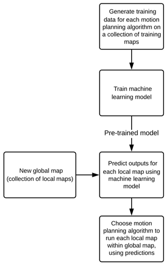
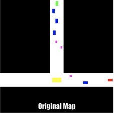
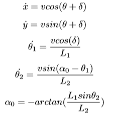
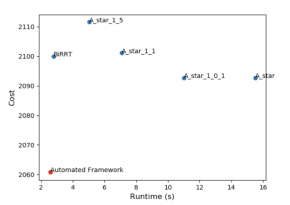
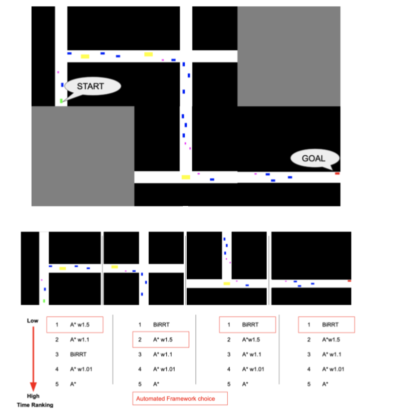

# Multi-planner approach using Machine Learning 

Authors: Dhanush Dineshan, Matthew Driesbach and Salman Javed 

Abstract—Autonomous vehicles have fast computational requirements, therefore it is necessary to choose the right planner for a given environment. Current research is focused on developing an algorithm that provides optimality, time complexity and completeness for any scenario at lower computation cost. Most techniques have unique strengths and weakness that make it difficult to find an optimal solution while maintaining low computation time for every scenario. The objective of this project is to create an automated framework that learns the most favorable planner for the path planning problem in a given a scenario. This is accomplished by building an automated framework based on machine learning.We demonstrated that the multi-planner approach based on machine learning algorithm yields a lower computational time compared to a single planner. The proposed automated framework predicts the output with 79.4% accuracy for holonomic motion.

 

 Fig 1. Data flow diagram for Automated Framework

 

 Fig 2. Autogenerated Map

Vehicle dynamic model considering non-holonomic constraints and addition of trailer. The front wheel is allowed steering described by steering wheel angle (δ) and the vehicle orientation is denoted by (θ). The non-holomomic constraints of the vehicle is expressed as differential equations of motion of the vehicle. The dynamic model includes the vehicle and trailer orientations as (δ1) and (δ2) and wheelbases as L1 and L2 respectively.

 

 Fig 3. Dynamics model used

 >

  Fig 4. Comparison of automated framework and single planners for global map in terms of path cost and runtime**

 

 Fig 5. Planners ranked low-high for individual maps. Red highlighted box depicts the planner chosen by the automated framework from among the planning library

In this paper we have introduced a machine learning approaching for multi-planner motion planning and analyzed the automated framework. The enabling idea behind this approach is the ability of the machine learning algorithm to learn about the behavior of the motion planners. Various experiments demonstrated the ability of the machine learning algorithm to correctly predict the planner depending on computational time or cost requirement. The results indicate that the proposed algorithm outperforms any single planner. However, when the proposed framework was expanded for non-holonomic motion, the results were not as promising. This paper leaves numerous extensions open for further research. First, it is of interest to find new ways to more accurately describe the task space. Secondly, an autoencoder may be able to extend the ability of our features to describe the task space and may enable the extension of this work to motion planning problems in higher dimensions. Thirdly, the outcome of the proposed approach would be interesting when utilising a library of different random sampling methods.

